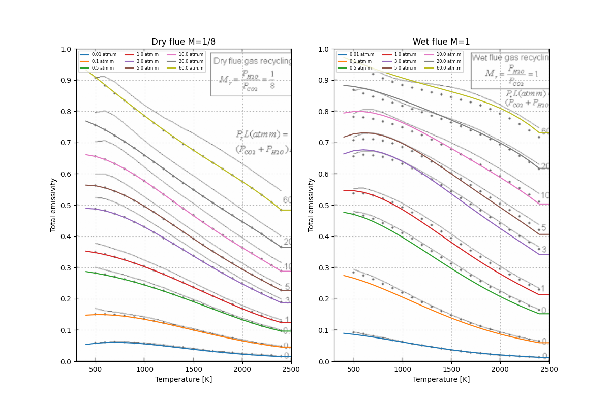

# Standalone C89 WSGG Model

Implements Weighted Sum of Gray Gases (WSGG) radiation properties model into a standalone, pure **C89 compliant module** with zero dependencies outside the standard math library.

---

## 📊 Validation Results

Implementation is validated against Fig. 2 of [Bordbar (2014)](https://doi.org/10.1016/j.combustflame.2014.03.013). Please check [validate/validate.py](./validate/validate.py) for more information.



---

## 📋 Environment

Building this project for evaluation of radiative properties of gases can be done locally under the hypothesis that you have installed:

- Python >=3.12
- uv (for managing the environment)
- gcc (on Windows, use MinGW64)

---

## 🛠️ Build and Compilation

Build the project by performing the following steps:

```bash
# Create virtual environment
uv venv --python 3.12 .venv

# Activate in Windows
. .venv/Scripts/activate

# Activate in Linux
source .venv/bin/activate

# Install the project
uv pip install .
```

For running the samples and validation scripts you need the optional dependencies. Install everything with:

```bash
uv pip install .[full]
```

---

## 🚀 Direct C Example Execution Output

A sample C program is provided for illustration purposes under [sample/wsggapp.c](./sample/wsggapp.c). The C89 code compiles cleanly and warning-free with strict standard-conforming flags `-Wall -Wextra -ansi -pedantic -O2 -fPIC`. The following instructions are to be run under `sample/` directory:

- 💻 Windows (PowerShell) compilation: run `.\makefile.ps1` for compiling with the Mingw64 GCC compiler `gcc.exe`.

- 🐧 Linux compilation: run `make` and everything should work with a C89 compliant compiler.

This builds:

- `wsgglib.dll` or `libwsgglib.so` — Standalone shared library.

- `wsggapp.exe` or `wsggapp` — Direct C illustration program.

Running `wsggapp.exe` or `wsggapp` gives the following output:

```
========================================================
   WSGGRadlibBordbar2020 C89 Model Call Illustration
========================================================

Inputs:
  Optical Path length (L):   1.00 m
  Gas Temperature (T):       1000.00 K
  Total Pressure (P):        101325.0 Pa (1.000 atm)
  H2O Mole Fraction (x_h2o): 0.180
  CO2 Mole Fraction (x_co2): 0.080
  Soot Vol Fraction (fv):    0.00e+00

Output Emissivity:           0.183685774525871

Intermediate Band-by-Band Coefficients:
  Band |   Absorption Coefficient [1/m]   |   Fractional Weight [-]
  -----|----------------------------------|-----------------------
    0  |          0.000000000000000e+00   |      2.700875528124971
    1  |          1.742166701236471e-02   |      0.274939183163228
    2  |          1.926201637035025e-01   |      0.288178187122667
    3  |          1.578204068390441e+00   |      0.234163841751569
    4  |          1.723962360219242e+01   |      0.090577827738800

========================================================
```

---

## 🧩 Integrating to Fluent

Before proceeeding, you might consider checking the following:

- [Fluent WSGG Model](https://ansyshelp.ansys.com/public/account/secured?returnurl=////Views/Secured/corp/v242/en/flu_th/flu_th_mod_var_abs.html)

- [Fluent UDF Documentation](https://ansyshelp.ansys.com/public/account/secured?returnurl=//Views/Secured/corp/v252/en/flu_udf/flu_udf_ModelSpecificDEFINE.html)

A minimal working example is provided under [sample/](sample/) directory and can be test following the steps:

1. Generate the mesh by running `python geometry.py` from within the environment and move the generated CGNS file to this directory.

2. Start Fluent in your favorite way and load the `fluent-setup.scm` journal file as running from this directory. This will setup a simple simulation and run until convergence.

3. Check the `fluent-upgrade.scm` file for the steps to hook the UDF to Fluent. The main steps include (1) creating UDM before, (2) compiling and loading the UDF, and (3) hooking the UDF to Fluent by setting the hooks of model update and weighting factor functions, and editing the material to use the UDF for absorption coefficients instead of the built-in model.

---

## 📁 Source File Guide

All the source files are located in the [src/](src/) directory.

- [wsgglib/](src/wsgglib/) - Python interface for evaluating the model using ctypes.

- [wsgglib.h](src/wsgglib.h) - Public C89 header exposing the clean function signatures.

- [wsgglib.c](src/wsgglib.c) — Implementation using Horner's method and embedding coefficients directly.

- [wsggudf.c](src/wsggudf.c) - Fluent UDF for calling the implemented WSGG model.
